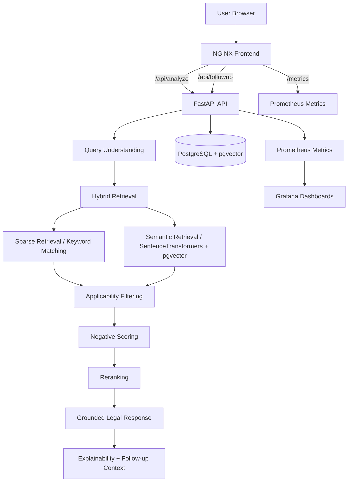

# Legal Situation Analyzer

Observable Hybrid RAG legal-analysis platform for Maharashtra Cooperative Housing Society bye-laws.

The project helps society members understand which Maharashtra Model Bye-law may apply to a situation, then explains the match in plain English, surfaces related rules, and offers follow-up guidance when the query is unclear or incomplete.

This repository evolved from a basic legal retrieval prototype into a retrieval-oriented AI systems project with:

- Hybrid retrieval
- Applicability-aware filtering
- Negative scoring
- Topic drift prevention
- Heuristic reranking
- Follow-up context handling
- Prometheus + Grafana observability
- Dockerized deployment
- Dual frontend workspaces

---

## What the system does

The platform is designed to answer legal-by-law questions in a grounded, retrieval-first way.

Instead of acting like a generic chatbot, the system:

1. understands the user’s housing society issue,
2. retrieves the most relevant bye-law,
3. checks whether the retrieved rule actually applies,
4. penalizes weak or drifting matches,
5. reranks the results,
6. explains the legal match in simple language,
7. tracks runtime behavior through observability metrics,
8. supports follow-up questions using prior context.

---

## Core architecture



---

## Frontend modes

The application currently exposes two UI workspaces:

- `/` → classic legal workspace
- `/modern/` → modern operational workspace

### Classic UI
The classic UI is the legal-editorial workspace inspired by the v9 reference design.  
It is intended to feel like a dense legal reasoning surface with structured cards, sections, and retrieval-oriented guidance.

### Modern UI
The modern UI is a cleaner operational workspace focused on interaction quality, routing, and production deployment stability.

Both frontends share the same backend APIs and retrieval system.

---

## Key features

### Retrieval and grounding
- Hybrid RAG retrieval pipeline
- SentenceTransformer embeddings
- pgvector semantic search
- keyword / topic retrieval
- structured legal metadata
- grounded explanation generation
- related-bye-law suggestions

### Retrieval quality controls
- applicability-aware filtering
- negative scoring for weak matches
- topic drift prevention
- heuristic reranking
- follow-up relationship guardrails

### Explainability
- primary bye-law
- explanation
- why it applies
- practical guidance
- related rules
- confidence score
- conditions required
- possible challenges
- recommended next steps
- documents to collect
- disclaimer

### Operational maturity
- Prometheus metrics
- Grafana dashboards
- Docker Compose deployment
- nginx routing
- security headers
- rate limiting
- trusted host filtering
- startup dataset sanity checks

---

## Retrieval workflow

```text
User query
↓
Query understanding
↓
Hybrid retrieval
  ├─ Sparse / keyword retrieval
  └─ Semantic / embedding retrieval
↓
Applicability filtering
↓
Negative scoring
↓
Topic drift prevention
↓
Heuristic reranking
↓
Grounded legal response generation
↓
Follow-up handling
↓
Prometheus metrics
↓
Grafana dashboards
```

### What the scoring layer does
The scoring layer combines multiple signals:

- semantic similarity
- keyword / full-text style overlap
- actor relevance
- issue relevance
- procedural relevance
- scenario relevance
- drift penalty
- applicability penalty

Weak or irrelevant candidates are penalized instead of being treated as equally valid matches.

---

## Query understanding and follow-up behavior

The backend has a light query-understanding layer that detects broad issue families such as:

- AGM / general body
- parking
- maintenance / sinking fund
- transfer / nomination
- audit
- redevelopment
- membership
- complaints

The follow-up flow is not treated as a replacement for retrieval.  
It is additive context that helps the system refine an already retrieved answer.

The follow-up guard prevents unrelated drift and limits repeated follow-up loops.

---

## API endpoints

### `POST /api/analyze`
Analyzes a housing society situation and returns the most relevant bye-law and explanation.

Example:

```json
{
  "description": "Our society used sinking fund for routine maintenance without a structural report or General Body approval."
}
```

### `POST /api/followup`
Answers a follow-up question using the previous answer context.

Example:

```json
{
  "question": "Does this need approval from all members?",
  "context": { "...": "previous analyze response" }
}
```

### `GET /health`
Simple backend health check.

### `GET /metrics`
Prometheus-compatible metrics endpoint.

---

## Observability

The project now includes retrieval observability through Prometheus and Grafana.

### Metrics exposed by the backend
- API request count
- API request latency
- retrieval latency
- reranker latency
- negative score count
- applicability filter rejection count
- retrieval failure count

### Why observability matters here
This is not generic server monitoring.  
The main goal is to understand retrieval behavior:

- Are the right laws being found?
- Are weak matches being rejected?
- Is the reranker improving the result?
- Is the retrieval pipeline slowing down?
- Are follow-ups producing drift?

That is the important observability story for this project.

---

## Dataset

The current dataset is an official-text-first hybrid dataset for Maharashtra Cooperative Housing Society bye-laws.

### Dataset characteristics
- 229 bylaw records
- Maharashtra, India jurisdiction
- structured metadata
- retrieval-friendly textual fields
- explanation and guidance fields
- compatibility with the existing schema
- source-grounded legal text where available

### Main sources
- Mysocietyclub bye-laws pages
- Sahakarayukta Maharashtra source material

### Why this dataset is important
The dataset is designed to reduce boilerplate contamination and preserve legally useful fields for retrieval and explanation.

---

## Data model

### `bylaws`
Core fields include:

- `section`
- `subsection`
- `title`
- `chapter`
- `topic`
- `topic_group`
- `issue_category`
- `keywords`
- `technical_terms`
- `layman_keywords`
- `official_excerpt`
- `normalized_legal_text`
- `source_grounded_official_text`
- `retrieval_text`
- `content`
- `explanation`
- `plain_english`
- `why_this_applies`
- `real_world_example`
- `common_disputes`
- `example_queries`
- `applicable_when`
- `trigger_conditions`
- `not_applicable_when`
- `issue_patterns`
- `recommended_next_steps`
- `documents_to_collect`
- `authority_to_approach`
- `embedding`

### `bylaw_relations`
Used to connect related rules:

- `source_section`
- `source_subsection`
- `target_section`
- `target_subsection`

### `query_logs`
The backend creates a query log table to track retrieval behavior and returned rules.

---

## Project structure

```text
legal-situation-analyzer/
├── api/
│   ├── applicability_filter.py
│   ├── bylaw_seed.py
│   ├── cache_service.py
│   ├── context_classifier.py
│   ├── context_memory.py
│   ├── database.py
│   ├── dataset_verifier.py
│   ├── drift_prevention.py
│   ├── embeddings.py
│   ├── explainability.py
│   ├── followup_guard.py
│   ├── hybrid_retrieval.py
│   ├── import_service.py
│   ├── main.py
│   ├── metrics.py
│   ├── prompt_builder.py
│   ├── query_understanding.py
│   ├── reranker.py
│   ├── schemas.py
│   ├── scoring.py
│   ├── search.py
│   └── ...
├── dataset/
│   └── bylaws_dataset.json
├── database/
│   └── init.sql
├── docker/
│   ├── Dockerfile.api
│   ├── Dockerfile.database
│   └── Dockerfile.frontend
├── frontend/
│   ├── index.html
│   ├── nginx.conf
│   ├── script.js
│   └── styles.css
├── frontend-modern/
│   ├── src/
│   ├── public/
│   ├── vite.config.ts
│   ├── package.json
│   └── ...
├── grafana/
│   └── provisioning/
├── kubernetes/
├── prometheus/
├── docker-compose.yml
└── README.md
```

---

## Deployment

### Local development / production-like run

```bash
docker compose up --build
```

This brings up the core stack:

- PostgreSQL database
- FastAPI backend
- classic frontend / nginx
- Prometheus
- Grafana

### Frontend URLs
- `http://localhost:8080/` → classic workspace
- `http://localhost:8080/modern/` → modern workspace

### Observability URLs
- `http://localhost:9090/` → Prometheus
- `http://localhost:3000/` → Grafana

### Backend URLs
- `http://localhost:8000/health`
- `http://localhost:8000/metrics`
- `http://localhost:8000/api/analyze`
- `http://localhost:8000/api/followup`

---

## Docker architecture

The Docker Compose stack contains:

- `db`
- `api`
- `frontend`
- `prometheus`
- `grafana`

The frontend nginx container serves both UI modes, while the API container serves retrieval and metrics endpoints.

---

## Kubernetes

The repository also includes Kubernetes manifests for deployment-oriented workflows.

Example application resources:
- API deployment
- frontend deployment
- PostgreSQL deployment
- app secret configuration

Kubernetes support is present, but the main day-to-day workflow is centered on Docker Compose for local and integrated deployment.

---

## Version evolution

### Early versions (v1–v8)
The project began as a simpler legal lookup / AI-assisted analysis experiment with basic retrieval and output generation.

### v9
The v9 frontend established the strongest editorial legal-workspace identity:
- dense layout
- serif typography
- structured reasoning cards
- better legal presentation
- better information hierarchy

### v10–v14
This phase focused on frontend experimentation and workspace refinement:
- more modern workspace structure
- React and Tailwind integration
- layout iterations
- retrieval panel composition
- infrastructure stabilization

### v15–v16
This phase matured the backend retrieval architecture:
- Hybrid RAG
- semantic + keyword retrieval
- applicability-aware filtering
- negative scoring
- drift prevention
- heuristic reranking
- follow-up guardrails
- initial observability direction

### v17
The current version becomes an observable legal AI platform:
- Prometheus metrics
- Grafana dashboards
- retrieval latency visibility
- scoring visibility
- retrieval failure visibility
- Dockerized operational stack
- dual frontend support
- stronger deployment and runtime maturity

---

## What v17 improved over earlier versions

### Compared with early versions
- Much better retrieval grounding
- Better legal applicability control
- More structured responses
- Better legal dataset handling

### Compared with v9
- Much stronger backend reasoning and retrieval pipeline
- More operational maturity
- Better observability
- Better deployment support

### Compared with v15–v16
- More complete metrics stack
- Better runtime visibility
- More production-minded architecture
- Better documentation potential

---

## Local dataset import

The dataset can be imported through the existing importer scripts.

Example commands:

```bash
python import_bylaws.py
python import_bylaws.py --dataset dataset/bylaws_dataset.json --replace-existing
python import_bylaws.py --dataset custom_bylaws.csv --replace-existing
```

For CSV imports, `conditions_required` uses:

```text
Requirement 1::Plain explanation 1|Requirement 2::Plain explanation 2
```

---

## Running the system

### First-time setup
```bash
docker compose up --build
```

### If you want a clean restart with database rebuild
```bash
docker compose down -v
docker compose up --build
```

### Validate backend manually
```bash
curl http://localhost:8000/health
curl http://localhost:8000/metrics
```

---

## Disclaimer

This system is built for informational legal guidance and retrieval assistance.

It does not replace registered bye-laws, legal counsel, or society-specific official records.

Always verify against the society’s registered bye-laws and applicable statutory sources.
